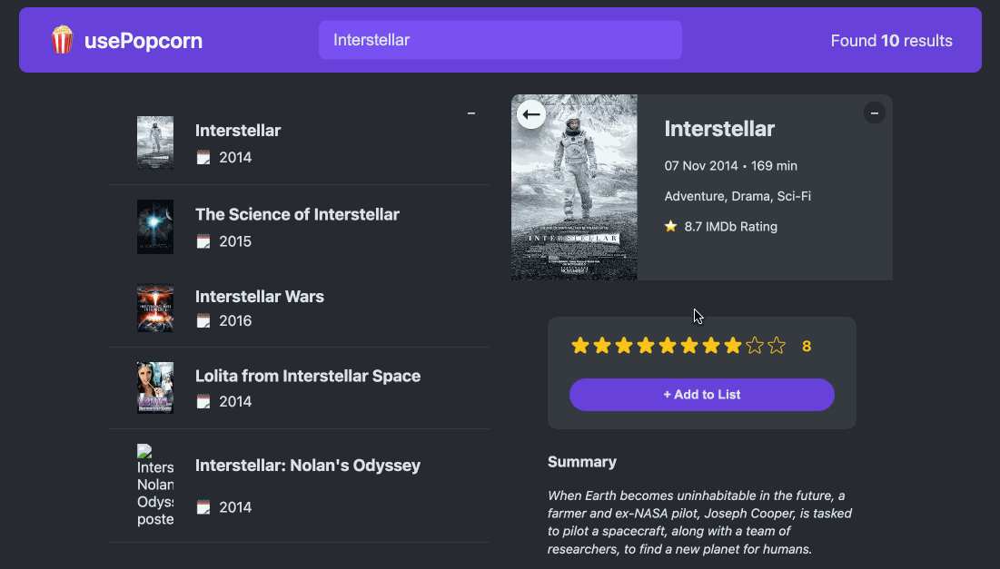

# usePopcorn
This is a web application using React.js to display movies from the [OMDb API](https://www.omdbapi.com/), with the functionalities to search for movies, rate the movies, and add them to a watched list.

## How to Run
0. Run the following command in the terminal to clone this repository to your local machine:
    ```bash
    git clone https://github.com/V1CTORHS1N/usePopcorn.git
    ```

1. Get your API key from [OMDb API](https://www.omdbapi.com/), and fill it in the `API_KEY` variable in `src/App.js`.

2. Run the following command to change directory to the cloned repository:
    ```bash
    cd /path/to/usePopcorn
    ```

3. Run the following command to install the dependencies:
    ```bash
    npm install
    ```
4. Run the following command to start the application:
    ```bash
    npm start
    ```

5. Enjoy your hacking!


## Demo

